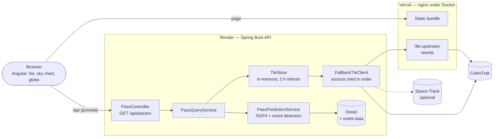

# Sat Pass Predictor

[](https://github.com/warlaxx/sat-pass-predictor/actions/workflows/ci.yml)

Computing and visualising satellite passes over a given point on Earth.
Java / Spring Boot backend with [Orekit](https://www.orekit.org/), Angular frontend.

> A learning project aimed at the space ecosystem: SGP4 propagation from TLEs, reference
> frames and time scales, visibility event detection.

## Stack

| Piece     | Choice                                  |
|-----------|-----------------------------------------|
| Backend   | Java 25, Spring Boot 4.1.1, Maven       |
| Dynamics  | Orekit 13.1.8                           |
| Frontend  | Angular 22 (standalone, signals, SCSS)  |
| TLEs      | CelesTrak GP API                        |

## Architecture



The browser computes nothing: every position the sky chart and the globe draw comes from
the API's `track`, sampled by Orekit. TLEs live in memory with their age exposed, and a restart fetches them again.
Optional PostgreSQL stores API keys and usage counters: see [API access](docs/api-access.md)
for activation, quotas and operator commands. The default demo still starts without a database.

## Prerequisites

- **JDK 25** — the project compiles with `release 25`; an older JDK fails with
  `release version 25 not supported`.

  ```bash
  brew install openjdk@25
  # Homebrew JDKs are keg-only: without this link, /usr/libexec/java_home cannot see them.
  sudo ln -sfn /opt/homebrew/opt/openjdk@25/libexec/openjdk.jdk \
               /Library/Java/JavaVirtualMachines/openjdk-25.jdk
  export JAVA_HOME=$(/usr/libexec/java_home -v 25)
  ```

- **No Maven to install**: `backend/mvnw` downloads the pinned version (3.9.16) on
  first use. It is the command the CI runs, so what passes here passes there.
- **Node 22 LTS**

## Running it with Docker

Nothing to install but Docker — no JDK, no Node, no Orekit data:

```bash
docker compose up --build
```

Then open <http://localhost:4200> (Swagger UI: <http://localhost:8080/docs>). The first
build takes a few minutes: Maven and npm dependencies, plus the Orekit data set, which is
downloaded **inside the API image at build time**, never at runtime. `API_PORT` and
`WEB_PORT` move the host ports when 8080 or 4200 are already taken by a dev server.

The two images are the two production pieces: `backend/Dockerfile` is the image Render
deploys, and nginx (`frontend/nginx.conf.template`) stands in for Vercel — static files,
`/api` forwarded server-side, the same caching rules as `vercel.json`.

## Getting started

For development, without Docker:

```bash
# 1. Orekit data (leap seconds, EOP, ephemerides) — ~100 MB, not committed
./scripts/fetch-orekit-data.sh

# 2. Backend (http://localhost:8080)
cd backend && ./mvnw spring-boot:run

# 3. Frontend (http://localhost:4200, /api proxied to 8080)
cd frontend && npm install && npm start
```

## Tests

```bash
cd backend  && ./mvnw verify
cd frontend && npm test
```

The cross-validation against Skyfield is a separate script, deliberately kept out of CI
(see [Validation](#validation)). It runs in its own virtual environment, so that it
depends neither on the machine's default `python` nor on a global installation:

```bash
python3 -m venv .venv-validation
.venv-validation/bin/pip install skyfield
.venv-validation/bin/python scripts/validate-against-skyfield.py
```

Skyfield requires Python 3. A `pip install` run under a still-active Python 2 — through
pyenv, for instance — fails while compiling `sgp4` with a `SyntaxError` in its `setup.py`:
the message points at sgp4, the cause is the interpreter. `python3 -m pip --version` says
which one is really in use.

## Orekit data

Orekit needs an external data set (UTC-TAI history, IERS Earth orientation parameters,
gravity models). Without it, the first call to `TimeScalesFactory.getUTC()` fails. Those
files are large and updated regularly: they are not committed, but downloaded by
`scripts/fetch-orekit-data.sh` and loaded at startup by `OrekitConfig`. The path is
configurable through `OREKIT_DATA_PATH`.

The application refuses to start if the directory is missing: an explicit failure at
startup beats an obscure error at the first computation.

## TLE sources

Orbital elements come from a **chain of sources, tried in order**, configured by
`tle.base-urls` and overridable in one go with `TLE_BASE_URLS` (comma-separated):

1. `https://celestrak.org` — the origin.
2. `https://sat-pass-predictor-nine.vercel.app/tle-upstream` — the same CelesTrak, reached
   through a rewrite on the frontend's host. It exists because CelesTrak silently drops
   packets coming from the shared outbound IPs of the platform the API is deployed on: a
   connect timeout, no refusal, no DNS error, on a host that answers other datacenters in
   10 ms. Reachability is not a property of a service alone.
3. **Space-Track**, optional, only when `SPACETRACK_IDENTITY` and `SPACETRACK_PASSWORD`
   are both set. Without them the application starts on the first two and says so in its
   startup log.

A source that says "I do not have this object" ends the chain; a source that cannot be
reached does not. Space-Track is an *availability* fallback, not a *coverage* one — it is
the catalogue CelesTrak republishes — and its calls are capped well under the published
limits of 30 a minute and 300 an hour, because an account suspended is a source lost.

The line to read in the startup log is `TLE sources, in order: [...]`. It says exactly
what this instance will try, which is the first thing worth knowing when the deployed
application and the local one disagree.

## Network resilience on Render

Connection establishment has a 5 s timeout and each source has its own 15 s request
budget. Render logs showed connection timeouts on both endpoints; response timings alone
cannot establish whether a connection or a response timed out. `render.yaml` prefers the
Vercel relay on Render. For a manually configured service, set `TLE_BASE_URLS` to
`https://sat-pass-predictor-nine.vercel.app/tle-upstream,https://celestrak.org` in its dashboard.
A Blueprint setting does not automatically update a manually created service.

Failed sources remain available but move to the end for ten minutes. When nothing has
been fetched, a failed attempt is remembered for 15 seconds to avoid serial network calls
from queued requests. Existing snapshots retain the five-minute retry interval and the
seven-day age limit. This store is still in memory: a restart loses it, and no timeout
setting guarantees availability during an upstream outage.

## Sky chart

Select a bar or table row to inspect a pass. The SVG uses the API track, with the selected
minimum elevation drawn as a dashed circle. Minute dots and phase details accompany a
shared clock: play/pause at 20×, scrub, stop at LOS, and reset when selecting another pass.
Playback starts paused (including for reduced-motion users). All displayed times include
local/UTC labels. Intermediate readouts interpolate API samples; no orbit is computed in
the browser. The curve distinguishes fully sunlit samples from eclipse (including penumbra).
The selected pass and table identify potential naked-eye visibility: the satellite must
be fully sunlit and the observer's Sun at or below -6°. Weather and brightness are not
modelled. Flags are sampled every 10 s, so short opportunities can be missed and
shadow-entry times are approximate. The API exposes these conditions separately as
`track[].illuminated` and `track[].visible`.

## Multi-satellite discovery

The “Next favourable window · 7 days” panel compares up to five distinct NORAD IDs,
using the observer and minimum elevation from the form. Each satellite gets one existing
`/api/passes` request with `hours=168`; no new backend contract is required. Results are
ranked by their first favourable **sample**, which may occur after AOS. The displayed
interval is the first consecutive run of favourable samples, not the entire pass.

Failures and empty results are reported per satellite. “Earliest” only covers successful
predictions; each seven-day window starts at that satellite's server computation time.
Restarting cancels pending browser requests. “Inspect pass” opens the returned prediction
in the existing table, sky chart and globe without fetching it again. The panel retains
the searched position and threshold so later form edits do not relabel old results.

The element age at the opportunity is shown, including the wait until the pass: a seven-day
forecast can rely on substantially older elements than the current TLE age suggests.
This remains a sampled geometric opportunity, not a brightness or weather forecast.

## Globe

A terrestrial-frame companion to the sky chart, sharing its clock: three.js (r128, UMD,
loaded from cdnjs — the one external runtime dependency in the frontend, with an explicit
fallback message if it cannot load) renders the ground track, the visibility circle and the
day/night terminator from the same `track` and `subPoint` data, drag to rotate. The ground
track's two colours now show the satellite's illumination computed by Orekit. Earth's
approximate terminator is only a visual reference and does not determine visibility.
Details and the decisions behind them: [ROADMAP.md](ROADMAP.md#milestone-8--3d-globe-done).

## Physical model

What the numbers mean, and what they do not. The code says the same thing where it
happens — mostly in `PassPredictionService`.

### Reference frames

| Frame | What it is | Role here |
|---|---|---|
| **TEME** | *True Equator, Mean Equinox* of date. Quasi-inertial, and specific to SGP4: its equinox is neither the true one nor a standard IERS one. | What SGP4 outputs. A TLE is only meaningful in it. |
| **GCRF** | *Geocentric Celestial Reference Frame*, the inertial IERS frame aligned with the ICRS. | The hub of Orekit's frame tree: TEME reaches ITRF through it. |
| **ITRF** | *International Terrestrial Reference Frame*, fixed to the Earth's crust and rotating with it. | Where the observer lives: WGS84 ellipsoid, `TopocentricFrame`. |

A classic mistake is to treat SGP4's output as if it were already in an inertial or
terrestrial frame. The error is not subtle: the ground under Lyon turns at about
325 m/s, so ignoring the Earth's rotation puts the satellite some 100 km off within the
five minutes of a pass. Here the satellite's state is expressed in
TEME and converted to ITRF **at every date**, through precession-nutation, the Earth's
rotation angle and polar motion (IERS 2010 conventions, full EOP, not the simplified
model). Elevation and azimuth are then read in the observer's topocentric frame.

### Time scales

| Scale | What it is | Role here |
|---|---|---|
| **UTC** | Civil time, kept within 0.9 s of the Earth's rotation by leap seconds. | Every instant the API reads or returns, and TLE epochs. |
| **TAI** | International Atomic Time, continuous. UTC = TAI − 37 s since 2017. | What Orekit computes in internally, so that a leap second never becomes a jump in a propagation. |
| **UT1** | The Earth's actual rotation angle, irregular and measured after the fact. | Orients ITRF with respect to the sky. UT1 − UTC comes from the EOP. |

The leap-second table (`tai-utc.dat`) is part of `orekit-data`. Without it, UTC cannot be
converted at all — which is why the application refuses to start rather than fail at its
first computation.

### Earth orientation parameters

The EOP, published by the IERS, describe what no formula can predict: UT1 − UTC, polar
motion (the rotation axis wanders by a few metres over the surface) and small nutation
corrections. For future dates — every prediction this application makes — Orekit uses the
*predicted* values of IERS Bulletin A shipped in `orekit-data`.

Their weight, in orders of magnitude: one second of UT1 error is 15 arcseconds of Earth
rotation, about 465 m at the equator; polar motion is a few metres. Both are far below the
SGP4 error described next. They are loaded anyway, because a correct frame chain costs
nothing at runtime, and because the Skyfield comparison can only be exact if the frames
are.

### Limitations of SGP4

- **The elements are mean elements, not a state.** A TLE is fitted to observations *for
  SGP4*: fed into any other propagator, it gives a wrong orbit. Orekit never reinterprets
  it outside `TLEPropagator`.
- **The error grows with the TLE's age**: about 1 km at the epoch, then roughly 1 to 3 km
  per day in low Earth orbit, more during a geomagnetic storm, when atmospheric drag
  departs from the single `B*` term the model has. Hence the TLE age banner, the refusal
  to predict past seven days of age, and the window capped at ten days.
- **Manoeuvres are invisible.** An ISS reboost makes every prediction based on the
  previous TLE wrong until a new one is published.
- **Positions are geometric.** No atmospheric refraction (about 0.1° near 5° of
  elevation, more below) and no light-time correction (a few milliseconds at low-orbit
  distances).

The second point dominates everything else in this list. Two days of age mean 2 to 6 km,
which the ISS covers in under a second at 7.7 km/s: invisible to a naked-eye observer,
but still a thousand times the EOP effects above. That is why the banner turns the age
into a timing order of magnitude instead of hiding it.

## Validation

An astrodynamics computation that is compared to nothing is not a computation, it is an
opinion. The project therefore rests on two distinct checks, which do not prove the same
thing and neither of which replaces the other.

**A single reference file.**
`backend/src/test/resources/validation/iss-lyon-reference.json` carries the TLE, the
observer, the window and the expected passes. It is read by the Java test *and* by the
Python script. Two files would have meant two truths, one of which could have lied
without a sound.

**Check 1 — regression (Java, in CI).**
`PassPredictionReferenceTest` verifies that Orekit reproduces the reference. It watches
for drift: a version bump, a refresh of the IERS data, a rewrite of the service. It says
nothing about correctness: a wrong computation would freeze a wrong reference, which this
test would then defend faithfully.

**Check 2 — correctness (Python, outside CI).**
`scripts/validate-against-skyfield.py` confronts the same reference with
[Skyfield](https://rhodesmill.org/skyfield/), an implementation of SGP4 written in Python,
sharing no code with Orekit.

The naive comparison — asking Skyfield for its passes and comparing dates — gives
discrepancies of up to a second, without saying which of the two is wrong: Skyfield's
`find_events` is documented as accurate to the second. The script therefore works the
other way round: it takes the dates produced by Orekit and asks Skyfield **what elevation
and azimuth it computes at those exact instants**. If Orekit is right, Skyfield must find
exactly the threshold at the boundaries of the pass.

Four checks: the boundaries, the culmination (its value and the fact that it is a local
maximum), the three azimuths, and completeness — the last one being the only check able to
detect a pass *missed* by Orekit's 60 s detection step.

### Tolerances, and why

| Quantity | Measured discrepancy | Tolerance | Margin |
|---|---|---|---|
| Elevation (Orekit vs Skyfield) | 0.53 millidegree | 10 millidegrees | x19 |
| Azimuth (Orekit vs Skyfield) | 2.0 millidegrees | 20 millidegrees | x10 |
| Dates (Java regression) | 0 | 1 s | — |
| Angles (Java regression) | 0 | 0.1 degree | — |

The regression tolerances are not physical error margins: they absorb an internal change
in Orekit, not a model error, which would be several orders of magnitude larger. Useful
landmarks: near AOS, the ISS gains about 0.1 degree of elevation per second — a
one-second discrepancy and a 0.1-degree discrepancy therefore describe the same event.

### What this validation does not prove

Skyfield and Orekit implement **the same model**, SGP4. Their agreement establishes that
this project's implementation and chain of frames are correct. It says nothing about the
gap to the real sky, which is dominated by the age of the TLE: in low Earth orbit, SGP4
drifts by roughly 1 to 3 km per day, more during a geomagnetic storm. That is a limitation
of the model, accepted, and the reason the forecast window is bounded to a few days.

A comparison against Heavens-Above would answer the other question. It was deliberately
set aside: its discrepancy mixes the TLE error, refraction and the site's own display
conventions, and would therefore not be interpretable.

### Why the Python script is not in CI

It would require Python and Skyfield in the workflow, to check a file that does not
change. The correctness of the reference is established once; it is its drift that must be
watched continuously, and the Java test takes care of that. The script is to be re-run by
hand whenever the reference changes — which is exactly what the comment at the top of the
JSON file asks for.

## Roadmap

Details, milestones and time budget: [ROADMAP.md](ROADMAP.md).

- [x] Orekit data loading, tested
- [x] Pass computation (`TLEPropagator` + `ElevationDetector`)
- [x] Cross-validation against an independent SGP4 implementation (Skyfield)
- [x] Track sampling (`track`, `OrekitStepHandler`, fixed 10 s step)
- [x] TLE retrieval from CelesTrak (last known TLE, age exposed)
- [x] REST API `/api/passes` (Problem Details, springdoc)
- [x] Frontend: shell, pass list, ribbon of nights, TLE age banner
- [x] Polar sky chart (SVG), shared selection and playback controls
- [x] 3D globe: ground track, visibility circle, terminator
- [x] Docker Compose, architecture diagram, physical model
- [ ] Demo GIF
- [x] Potential naked-eye visibility (sunlight + observer darkness)
- [x] Multi-satellite discovery and next favourable window
- [x] Optional PostgreSQL with hashed API keys, quotas and persistent usage counters (milestone 11)

Validated interface mockup: [docs/interface-mockup.html](docs/interface-mockup.html)
(open it in a browser).

## How this repository was written

Part of the code in this repository was written with the assistance of Claude
(Anthropic): the commits concerned carry a `Co-Authored-By` trailer. Better said here
than left for the reader to discover in `git log`.

What that covers, concretely:

- Code and tests were written with assistance, then **run and confronted with an
  independent reference** before being committed. The [Validation](#validation) section
  describes the procedure; anyone can reproduce it with two commands.
- Non-trivial technical decisions are documented in the code, with their rationale and
  their trade-off: the 60 s detection step instead of the 600 s default, the
  `ContinueOnEvent` handler without which only one pass would be detected, the elevation
  maximum as a *decreasing* event of the derivative, the exclusion of passes truncated by
  the edges of the window.
- The limitations of the model are written down rather than passed over in silence: SGP4
  drift, no refraction below 5 degrees, the real reach of the validation.

A tool that writes code does not excuse you from being able to defend it. This section
exists so that the repository is judged on what it demonstrates, not on what it hides.
