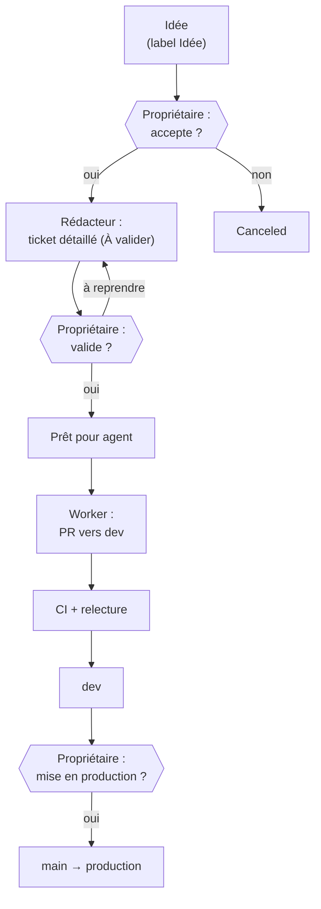

# Pilotage par agents

Le propriétaire pilote NextPass depuis **une seule conversation** : la session
« Copilote NextPass » dans Claude. Le Copilote fait travailler les autres agents en
coulisse et ne décide jamais à la place du propriétaire.

Ce fichier est aussi **la mémoire du Copilote** : une session Claude finit par résumer
son contexte, donc tout ce qui doit survivre (décisions, mesures, état des chantiers)
s'écrit ici ou dans Linear. Ce qui n'est écrit nulle part est perdu.

## Les agents

| Agent | Fichier | Déclenché par | Produit |
| :--- | :--- | :--- | :--- |
| Copilote | [`copilote.md`](../.claude/agents/copilote.md) | le propriétaire ; Routine chaque matin à 8 h 52 (Paris) | point du matin, revue hebdo le lundi, conseils, relais des validations |
| Rédacteur | [`redacteur.md`](../.claude/agents/redacteur.md) | le Copilote, à la demande | un ticket Linear détaillé, label `À valider` |
| Worker | [`worker.md`](../.claude/agents/worker.md) | le Copilote, à la demande | une PR vers `dev` pour un ticket `Prêt pour agent` |

Le Rédacteur et le Worker sont des **sous-agents** que le Copilote lance depuis sa
session (outil Agent, type `redacteur` ou `worker`, le Worker dans un worktree isolé),
avec l'identifiant du ticket. Ils héritent ainsi des accès de la session (dépôt, Linear,
GitHub), ce qu'une Routine lancée dans une session neuve n'aurait pas. Rien ne tourne
pour rien.

### Routine

| Routine | Identifiant | Horaire | Cible |
| :--- | :--- | :--- | :--- |
| NextPass · Point quotidien du Copilote | `trig_01TC6w54Ue4hc4bLdE83KpxN` | tous les jours 8 h 52, Europe/Paris | la session « Copilote NextPass » |

À venir, une fois le pipeline fiable : un agent **Ops** (logs Render, import nocturne,
disponibilité → bugs Linear), puis un agent **Recherche produit** (hebdo, propositions
étayées par des données, label `Idée`).

## Le pipeline

Les étapes se lisent sur le groupe de labels **Pipeline** de Linear (sélection unique) ;
les colonnes de statut habituelles (In Progress, In Review, Validated in DEV…) restent
celles du [CLAUDE.md](../CLAUDE.md).

| Label | Sens | Qui le pose |
| :--- | :--- | :--- |
| `Idée` | proposition non validée | n'importe qui |
| `À valider` | ticket rédigé, attend le propriétaire | Rédacteur |
| `Prêt pour agent` | le propriétaire a validé | Copilote, **sur ordre explicite du propriétaire** |
| `Humain requis` | Stripe, OAuth, secrets, comptes, décision commerciale | Rédacteur ou Copilote |

## Règles non négociables

1. **Trois portes humaines** : idée → ticket, ticket → développement, `dev` → `main`.
   Aucune ne s'ouvre sans un « oui » écrit du propriétaire dans la conversation.
2. **Aucun agent ne fait avancer son propre travail** à l'étape suivante.
3. **Aucun agent ne fusionne dans `main`.** Le Copilote prépare la PR `dev` → `main`
   avec une ligne `Fixes ABD-…` par ticket embarqué ; le propriétaire la fusionne.
4. **Un ticket = un Worker = une PR.** Pas d'agents qui se parlent entre eux : ils
   communiquent par Linear et par les PR.
5. **`Humain requis` n'est jamais implémenté par un agent.**
6. Un conseil du Copilote s'appuie sur un fait vérifiable (CI, ticket, mesure, log),
   pas sur une impression.

## Journal des décisions

Le Copilote ajoute une ligne par décision du propriétaire (date, ticket, décision, raison).

| Date | Ticket | Décision | Raison |
| :--- | :--- | :--- | :--- |
| 2026-10-08 | ABD-54 | Mise en place du pilotage : Copilote, Rédacteur, Worker | Livrer plus vite en gardant la main ; Ops et Recherche produit viendront ensuite |
| 2026-10-08 | ABD-54 | Point du Copilote chaque matin, revue complète le lundi | Le propriétaire veut un point quotidien |
| 2026-10-08 | ABD-15 | Accepté : à faire rédiger par le Rédacteur | Premier test du pipeline |

## Mesures du pilote

À remplir à chaque revue hebdo ; c'est ce qui dira s'il faut ajouter des agents.

| Semaine | PR ouvertes par le Worker | Fusionnées sans retouche | Retouches lourdes | Remarques |
| :--- | :---: | :---: | :---: | :--- |
